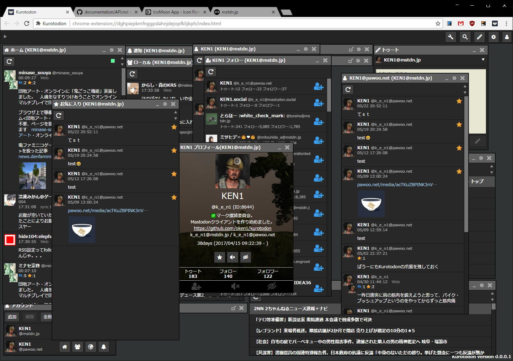

Kurotodon
=============

KuroTwiをベースに、Mastodonのクライアントを作っています。

Screenshot
=============

Installation
=============

１．ZIPでダウンロード  
２．適当なところに展開  
３．Chromeの拡張機能画面で「パッケージ化されていない拡張機能を読み込む」で展開したフォルダを指定
